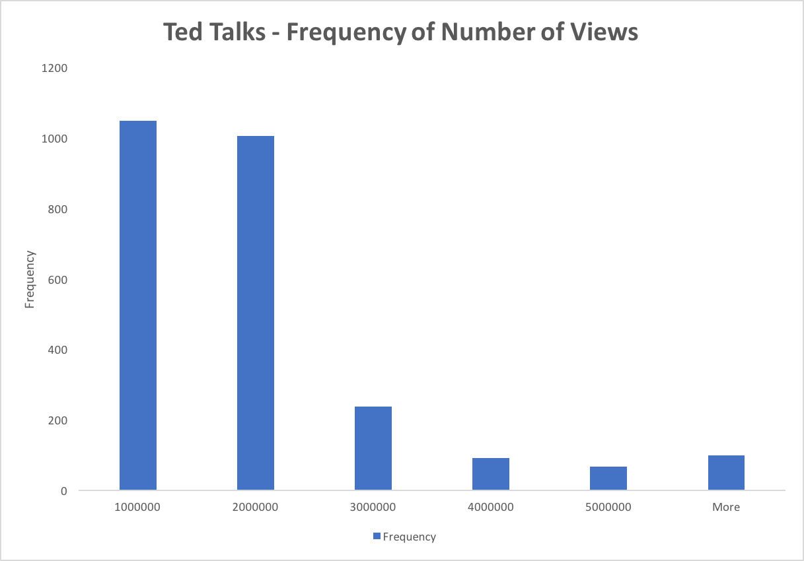

I found an interesting data set on all Ted Talks uploaded to Ted.com up
to and including September 21st, 2017. This is the link for the dataset:
<https://www.kaggle.com/rounakbanik/ted-talks/data>. This dataset
includes information on number of views and comments. It also includes a
description of each talk, along with corresponding titles and speakers.
I found this data set to be interesting because by applying analytical
methods, it is possible to reverse-engineer the \"optimal\" Ted Talk
based on its content. For example, I am curious whether Ted Talks with
different themes have different optimal lengths. This dataset would shed
light as to whether there is a different ideal length of a Ted Talk in
the *Funny* category versus the *Inspiring* Category (in order to
maximize views and comments). Additionally, I wonder if certain words or
phrases in titles tend to attract more views and responses.

There are no missing values in this data set, so data cleansing is not
necessary. Below is a plot the number of views for each Ted Talk. I
chose to plot this as a stacked column graph because I was curious if
visualizing the data would indicate whether there are any trends in
number of views. The plot is below.


I find it interesting very few Ted Talks receive over 2,000,000 views. I
wonder if there is any commonality regarding style, content, and
duration of speech among these Ted Talks that did exceptionally well. To
better view the frequency of number of views across all Ted Talks, a
histogram would be helpful. The histogram of this data is below.





From exploring the data, I am able to conclude that the Ted
Talks that receive over 2,000,000 views are indeed outliers. There must
be a underlying trend that explains the distribution of views. This is
likely categorical, including titles and tags in the posted videos. The
next step in exploring this data would be to use a classification
algorithm to sort the data based off of both content categories (like
funny inspiring, etc.), duration in order to determine if further
relationships exist between these categories.


```python

```
